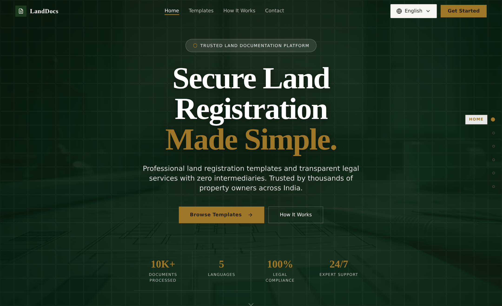
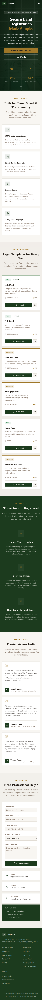

# LandDocs — Land Registration Templates & Documentation Platform

> A multilingual, professional-grade web application for secure land registration documentation in India.

---

## Preview

**Desktop**



**Mobile**



---

## What is LandDocs?

LandDocs is a React-based web platform that helps property owners, legal professionals, and individuals navigate land registration paperwork without intermediaries. It provides downloadable legal document templates (sale deeds, gift deeds, lease agreements, etc.) in five Indian languages, along with a professional services inquiry form.

The platform is built with transparency as its core value — no hidden fees, no middlemen, just clean documentation tools accessible to anyone.

---

## Features

### Multilingual Support
The entire UI is available in five languages, switchable at any time via the language selector in the top navigation:

| Code | Language |
|------|----------|
| `en` | English  |
| `hi` | Hindi (हिंदी) |
| `kn` | Kannada (ಕನ್ನಡ) |
| `mr` | Marathi (मराठी) |
| `te` | Telugu (తెలుగు) |

Every section — hero copy, template names, form labels, contact details, and the footer — switches dynamically with no page reload.

### Document Templates
Six pre-built legal templates are available:

| Template | Type |
|----------|------|
| Sale Deed | Free |
| Gift Deed | Free |
| Lease Deed | Free |
| Partition Deed | Premium |
| Mortgage Deed | Premium |
| Power of Attorney | Premium |

Each card shows download count, user rating, and a preview option.

### Professional Services Contact Form
Users can submit inquiries for:
- Document Verification
- Legal Consultation
- Registration Process assistance
- Title Search
- Custom Template requests

The form includes name, email, phone, service type, and message fields with basic validation.

---

## Tech Stack

| Layer | Technology |
|-------|-----------|
| Framework | React 18 with TypeScript |
| Build Tool | Vite |
| Styling | Tailwind CSS with a custom design token system |
| UI Components | shadcn/ui (Radix UI primitives) |
| Routing | React Router DOM |
| State / Data | TanStack Query (React Query) |
| Notifications | Radix Toast + Sonner |

---

## Project Structure

```
src/
├── assets/               # Static images (hero background)
├── components/
│   ├── Navbar.tsx            # Sticky top nav with scroll-spy + mobile drawer
│   ├── HeroSection.tsx       # Landing hero with CTA and stats
│   ├── FeaturesSection.tsx   # "Why LandDocs" feature cards
│   ├── TemplatesSection.tsx  # Document template cards grid
│   ├── HowItWorksSection.tsx # Three-step process
│   ├── TestimonialsSection.tsx # Client testimonial cards
│   ├── ContactSection.tsx    # Inquiry form + contact info
│   ├── SectionNav.tsx        # Right-rail section dot navigation
│   ├── ScrollProgress.tsx    # Top reading-progress bar
│   ├── Reveal.tsx            # Scroll-triggered reveal wrapper
│   ├── LanguageSelector.tsx  # Dropdown to switch UI language
│   └── ui/               # shadcn/ui base components
├── hooks/
│   ├── use-toast.ts      # Toast notification logic
│   └── use-mobile.tsx    # Responsive breakpoint hook
├── pages/
│   ├── Index.tsx         # Main page — composes all sections
│   └── NotFound.tsx      # 404 fallback page
├── lib/
│   └── utils.ts          # Tailwind class merge utility
├── index.css             # Design tokens, animations, custom utilities
└── App.tsx               # Root component with routing and providers
```

---

## Design System

The app uses a custom CSS token system defined in `index.css` built around a **warm, professional legal theme**:

- **Background** — Warm cream (`hsl(40, 30%, 96%)`)
- **Primary** — Deep forest green (`hsl(125, 36%, 17%)`)
- **Secondary** — Mid forest green (`hsl(125, 28%, 34%)`)
- **Accent** — Warm gold (`hsl(40, 60%, 39%)`)
- **Success** — Legal green (`hsl(142, 48%, 36%)`)

Typography pairs **Playfair Display** (serif headings) with **Inter** (sans body). A full dark theme is also defined via the `.dark` token set.

Custom utilities include `.hover-lift`, `.reveal` (scroll-triggered fade/slide-in), `.section-divider`, and keyframe animations (`fadeInUp`, `fadeIn`) for polished motion. Smooth scrolling with navbar-aware `scroll-padding` and `prefers-reduced-motion` support is handled in the base layer.

---

## Getting Started

### Prerequisites
- Node.js (v18+ recommended)
- npm

### Installation

```bash
# Clone the repository
git clone https://github.com/vijaykumaro7/landscribe-docs.git

# Navigate into the project
cd landscribe-docs

# Install dependencies
npm install

# Start the dev server
npm run dev
```

The app will be available at `http://localhost:8080` by default.

---

## Deployment

This project is hosted and deployed via [Lovable](https://lovable.dev/projects/b4edeb17-f281-4fa6-a7d6-fbf59c100469).

To publish: open the Lovable project → **Share** → **Publish**.

To connect a custom domain: **Project → Settings → Domains → Connect Domain**.

---

## Target Users

- Property buyers and sellers navigating registration paperwork independently
- Legal professionals looking for ready-to-use, compliant document templates
- Citizens in Karnataka, Maharashtra, Telangana, and other states who need vernacular-language documentation support

---

## Roadmap (Suggested)

- [ ] Backend integration for actual template downloads (PDF generation)
- [ ] User authentication and saved documents
- [ ] Payment gateway for premium templates
- [ ] More regional language support (Tamil, Bengali, Gujarati)
- [ ] Real form submission with email notification

---

## License

© 2024 LandDocs. All rights reserved. Made in India 🇮🇳
