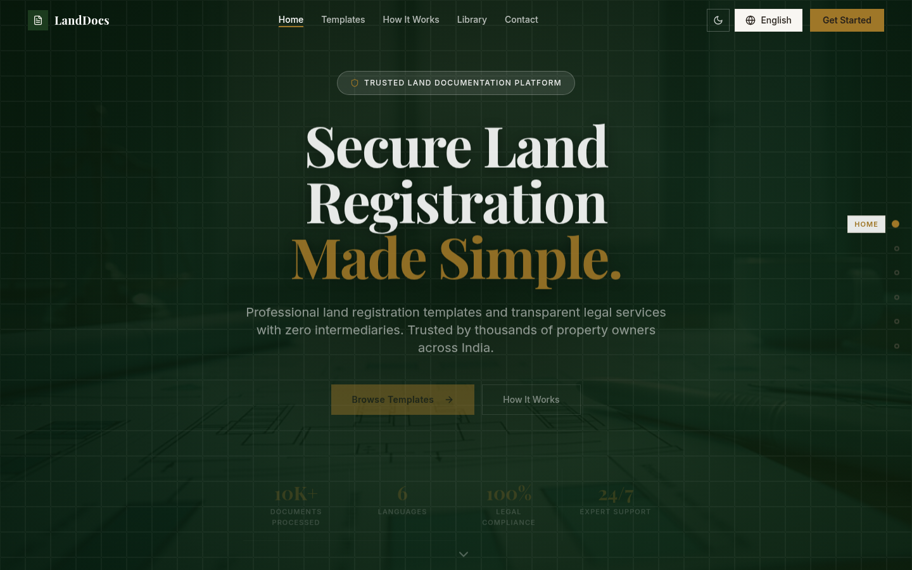
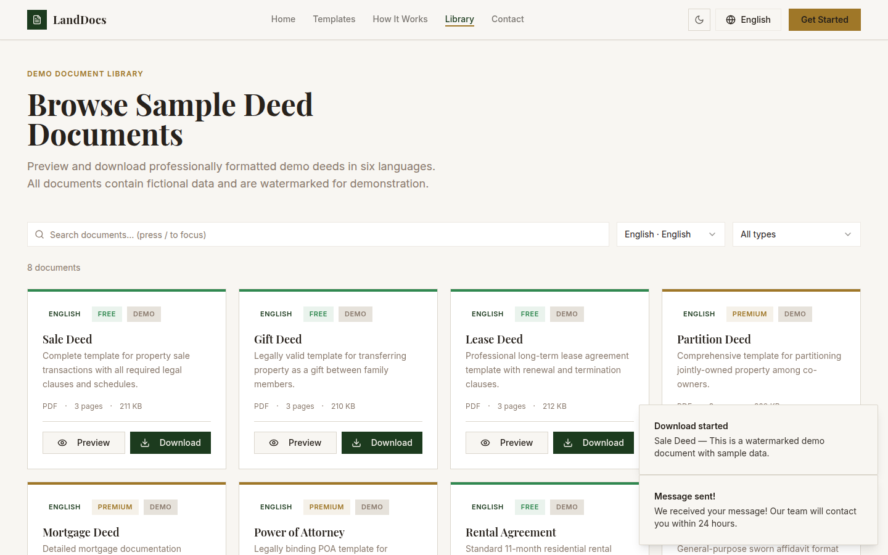
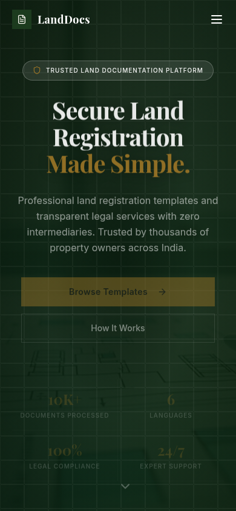

# LandDocs — Land Registration Templates & Documentation Platform

> A multilingual, professional-grade web application for secure land registration documentation in India — with a built-in demo library of 48 watermarked sample deeds in 6 languages.

---

## Preview

**Desktop**



**Document Library**



**Mobile**



---

## What is LandDocs?

LandDocs is a React-based web platform that helps property owners, legal professionals, and individuals navigate land registration paperwork without intermediaries. It provides downloadable legal document templates (sale deeds, gift deeds, lease agreements, and more) in six Indian languages, along with a professional services inquiry form.

The platform is built with transparency as its core value — no hidden fees, no middlemen, just clean documentation tools accessible to anyone.

---

## Features

### Multilingual Support (6 languages)

The entire UI — and every demo document — is available in six languages, switchable at any time via the language selector in the top navigation. The choice persists across visits (localStorage) and is reflected in `<html lang>` for screen readers.

| Code | Language |
|------|----------|
| `en` | English  |
| `hi` | Hindi (हिंदी) |
| `kn` | Kannada (ಕನ್ನಡ) |
| `mr` | Marathi (मराठी) |
| `ta` | Tamil (தமிழ்) |
| `te` | Telugu (తెలుగు) |

### Demo Document Library (`/library`)

A searchable, filterable library of **48 professionally formatted demo PDFs** — 8 deed types × 6 languages:

| Deed type | Tier |
|-----------|------|
| Sale Deed | Free |
| Gift Deed | Free |
| Lease Deed | Free |
| Rental Agreement | Free |
| Affidavit | Free |
| Partition Deed | Premium |
| Mortgage Deed | Premium |
| Power of Attorney | Premium |

Library features: full-text search (press `/` to focus), language and deed-type filters, in-browser PDF preview dialog, one-click downloads, per-document metadata (pages, file size), and a friendly empty state.

Every demo PDF includes realistic-but-fictional parties, a property schedule with boundaries, numbered legal clauses, signature and witness sections, a registration-details block with seal, page numbers, a repeating **"DEMO DOCUMENT" watermark**, and PDF metadata marking it as a demonstration sample. Native-script typography (Noto Serif families) is used for each language.

### Landing Page

Hero with stats, feature highlights, template cards (real download + preview wired to the demo PDFs), a three-step process section, testimonials, and a contact form with inline validation — all fully translated.

### Light / Dark Mode

Theme toggle in the navbar (powered by `next-themes`), with design tokens tuned for both modes.

---

## Tech Stack

| Layer | Technology |
|-------|-----------|
| Framework | React 18 with TypeScript |
| Build Tool | Vite (code-split routes, self-hosted fonts) |
| Styling | Tailwind CSS with a custom design token system |
| UI Components | shadcn/ui (Radix UI primitives) |
| Routing | React Router DOM |
| State / Data | React context (i18n, theme) + TanStack Query (document manifest) |
| Notifications | Radix Toast + Sonner |
| PDF Generation | Playwright (Chromium print-to-PDF) + pdf-lib, offline at build time |

---

## Getting Started

```sh
npm install
npm run dev        # start dev server on :8080
npm run build      # production build into dist/
npm run preview    # serve the production build
npm run lint       # eslint (zero warnings)
```

### Regenerating the demo PDF library

The 48 PDFs in `public/documents/` are committed, so this is only needed when the deed content in `scripts/content/` changes:

```sh
npm run fetch:fonts     # one-time: install Noto fonts (Latin + Indic) into ~/.fonts
npm run generate:pdfs   # render all deeds to public/documents/ + manifest.json
```

The generator needs a Chromium binary — it auto-detects the Playwright browsers directory, or set `CHROMIUM_PATH`.

---

## Project Structure

```
src/
├── assets/                    # Static images (hero background)
├── components/
│   ├── Navbar.tsx                 # Route-aware sticky nav + scroll-spy + mobile drawer
│   ├── ThemeToggle.tsx            # Light/dark mode switch
│   ├── LanguageSelector.tsx       # Language dropdown (context-backed)
│   ├── HeroSection.tsx            # Landing hero with CTA and stats
│   ├── FeaturesSection.tsx        # "Why LandDocs" feature cards
│   ├── TemplatesSection.tsx       # Template cards wired to real demo PDFs
│   ├── HowItWorksSection.tsx      # Three-step process
│   ├── TestimonialsSection.tsx    # Client testimonial cards
│   ├── ContactSection.tsx         # Inquiry form with inline validation
│   ├── Footer.tsx                 # Localized footer
│   ├── DocumentPreviewDialog.tsx  # In-browser PDF preview with loading state
│   ├── ErrorBoundary.tsx          # Friendly crash-recovery screen
│   ├── PageLoader.tsx             # Suspense fallback for lazy routes
│   ├── ScrollToTop.tsx            # Scroll restoration on route change
│   ├── SectionNav.tsx             # Right-rail section dot navigation
│   ├── ScrollProgress.tsx         # Top reading-progress bar
│   ├── Reveal.tsx                 # Scroll-triggered reveal wrapper
│   └── ui/                        # shadcn/ui base components
├── data/
│   └── documents.ts           # Deed-type catalog: tiers, localized labels, PDF URLs
├── i18n/
│   ├── config.ts              # Language codes, SUPPORTED_LANGUAGES, Translations<T>
│   ├── context.ts             # useLanguage / useTranslation hooks
│   └── LanguageProvider.tsx   # Persistence + <html lang> sync
├── hooks/                     # use-toast, use-mobile
├── lib/                       # cn() utility, downloadFile()
├── pages/
│   ├── Index.tsx              # Landing page (composes all sections)
│   ├── Library.tsx            # Demo document library (lazy-loaded)
│   └── NotFound.tsx           # 404 page (lazy-loaded)
├── fonts.css                  # Self-hosted font faces (latin subset)
└── index.css                  # Design tokens, animations, utilities

scripts/
├── generate-demo-pdfs.mjs     # Chromium print-to-PDF + pdf-lib metadata + manifest
├── fetch-fonts.sh             # Downloads Noto fonts needed for PDF generation
└── content/                   # Deed text in all 6 languages (fictional data)
    ├── frame.mjs              # Shared labels, parties, property schedule
    └── deeds-{en,hi,kn,mr,ta,te}.mjs

public/
├── documents/                 # 48 generated demo PDFs + manifest.json
└── fonts/                     # Self-hosted Inter + Playfair Display (woff2)
```

---

## Architecture Notes

- **i18n**: a small custom context (`src/i18n/`) rather than a heavyweight library. Translation tables are colocated with the components that use them and typed as `Translations<T> = Record<LanguageCode, T>`, so adding a language is a compile-time checklist.
- **Demo PDFs are generated offline**, not in the browser: Indic scripts need real text shaping, which browser-side PDF libraries don't do reliably. Chromium's print pipeline shapes Devanagari/Kannada/Tamil/Telugu perfectly, and `pdf-lib` stamps demo metadata afterwards.
- **Performance**: the library and 404 routes are code-split; fonts are self-hosted with `font-display: swap` and preloaded; the hero image has explicit dimensions to avoid layout shift; `prefers-reduced-motion` disables animations.
- **Accessibility**: skip-to-content links, `aria-current` navigation, labelled form fields with inline `role="alert"` errors and focus management, keyboard shortcut (`/`) for library search, focus-visible states throughout.

---

## Target Users

- Property buyers and sellers navigating registration paperwork independently
- Legal professionals looking for ready-to-use, compliant document templates
- Citizens in Karnataka, Maharashtra, Tamil Nadu, Telangana, and other states who need vernacular-language documentation support

---

## Disclaimer

All demo documents contain **fictional** names, addresses, and details. They are watermarked samples for demonstration purposes only and are not valid for registration or any legal use.

---

## Roadmap (Suggested)

- [ ] User authentication and saved documents
- [ ] Payment gateway for premium templates
- [ ] Editable templates (fill party/property details before download)
- [ ] More regional language support (Bengali, Gujarati)
- [ ] Real form submission with email notification

---

## License

© 2024–2026 LandDocs. All rights reserved. Made in India 🇮🇳
